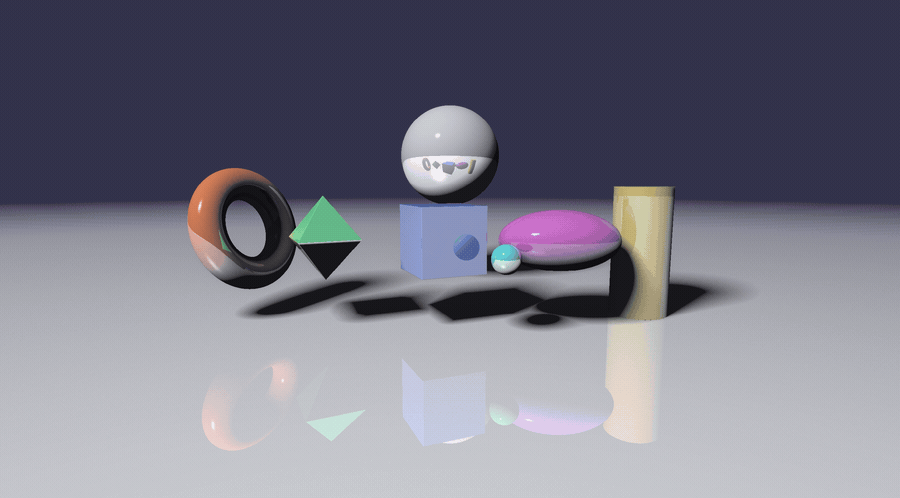

# Raymarch Engine (WIP)

A game engine that renders primitive objects by utilizing raymarching. Different operations can be applied to the
primitives to create more complex objects. The engine uses `SharpDX` as its `DirectX`
wrapper and `System.Numerics.Vectors` for Vectors, Quaternions and Matrices.

Raymarch shader code is located [here](Shaders/Raymarch/Pixel.hlsl).

## Live rendering preview

### Things to look for:

The scene the engine starts with is built in `GameLogic.BuildScene`, and everything below is in
frame from the first rendered image without the camera having to move.

- Seven primitive types at once (torus, octahedron, box, sphere, ellipsoid, cylinder, plane), lit
  by a directional sun that sweeps across the sky and warms as it drops.
- A gradient sky with a sun disk and glare, and a single flat layer of clouds drifting over it.
  Both are analytic, so the background costs about a tenth of a millisecond at 1440p.
- The torus tumbles on two axes, the box turns on the spot, the octahedron bobs and spins, and a
  small sphere orbits the box. Rotation is per-object, sent to the shader as a quaternion.
- A checkerboard floor, filtered analytically from the screen space derivatives so it fades to
  its own average with distance instead of tearing into moire.
- All objects cast and receive shadows. These are fully dynamic and soft.
- The floor and most of the shapes are reflective. The mirror ball above the box shows the whole
  row reflected in it, and the floor shows every shape a second time.
- Per-object materials: colour, specular exponent, specular strength and reflectivity all come
  from the `RaymarchRenderer<T>` that placed the shape.
- All objects have Phong shading as a base.
- There is ambient occlusion applied to the view space, dithered with a noise texture.
- Aerial perspective: distant geometry fades towards the sky colour in the direction being looked
  at, and reflections show the sky rather than black.
- Raymarched objects have infinite resolution (signed distance function = no mesh).

Move with WASD, look with the mouse, hold shift to sprint, escape to quit. Jump with space or
the scroll wheel, either direction, which is the bind players use to bunny hop.

A crosshair sits in the middle and the ground speed is printed top left, in Source units, so it
reads 320 at a walk exactly as it would in Source.

## Download

Every merge to `release` publishes a [release](https://github.com/Saggre/raymarch-engine/releases)
with a zipped x64 build. Unzip it and run `RaymarchEngine.exe`. The zip has to stay together: the
engine loads `Shaders/Raymarch` from disk on the first frame, so the exe on its own will not start.

## Branches

`master` is the development branch and `release` is what ships. Work goes into `master` through
`feature/*` branches, and merging `master` into `release` cuts a release. Development builds are
versioned `0.0.2-alpha.43`, releases `0.0.2`.

## Requirements:

- .NET Framework 4.8
- C# 7.3+
- DirectX 11
- Shader Model 5 support
- A capable GPU

## Supported primitives:

These can be placed from game code as a `RaymarchRenderer<T>`, and each has its own buffer the
engine uploads every frame:

- Sphere
- Box
- Plane
- Torus
- Ellipsoid
- Cylinder
- Octahedron

Signed distance functions for these also exist in `Shaders/Raymarch/Primitives.hlsl`, but they are
not wired up to a buffer yet:

- Capped torus
- Capsule
- Hex prism
- Cone
- Pyramid
- Rhombus

## Supported operations:

+ Rounding
+ Infinite repetition
+ Union
+ Subtraction
+ Intersection
+ Onion slicing

## Current features and future work:

- :heavy_check_mark: Basic gameobjects
- :heavy_check_mark: Basic shading (Phong)
- :heavy_check_mark: Ambient occlusion
- :x: Subsurface scattering (getSubsurfCheap exists but is too expensive to enable)
- :x: Blue noise (the AO dither currently uses fractal value noise instead)
- :heavy_check_mark: Reflections
- :heavy_check_mark: Soft shadows
- :heavy_minus_sign: All primitives
- :x: Dynamic sky
- :x: Custom resolutions
- :x: Color blending between shapes
- :x: Fractals
- :x: Physics
- :x: Custom shader code editor
- :x: Checkerboard rendering
- :x: Pre-compiled shaders
- :x: OpenGL support
- :x: Hyperbolic and spherical spaces